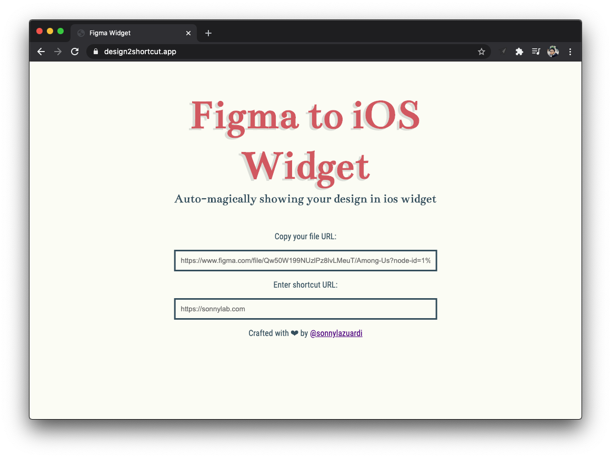

## Figma to iOS Widget



> Can I show my figma canvas directly in my homescreen?

Everyone knows that apple just released widget on iOS 14. One exciting thing is that we can add custom widget on our home screen. There is a [Glimpse App](https://apps.apple.com/us/app/glimpse-2/id1524217845) to show snippet of a web page to your widget, but this small tool will help you to show your figma canvas rendered as a URL that you can put in the glimpse app.

[Click here to check out Figma Widget yourself!](https://design2shortcut.app/)

Make it your own:

## Getting Started

First, run the development server:

```bash
npm run dev
# or
yarn dev
```

Open [http://localhost:3000](http://localhost:3000) with your browser to see the result.
